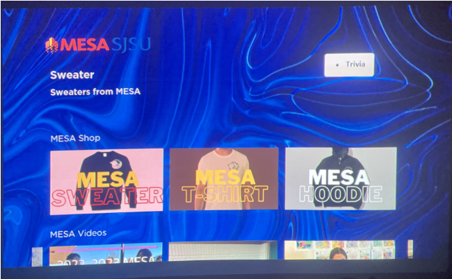
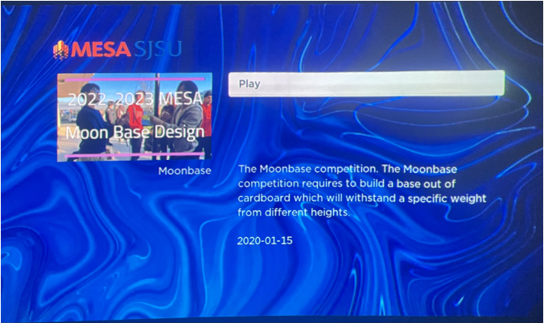
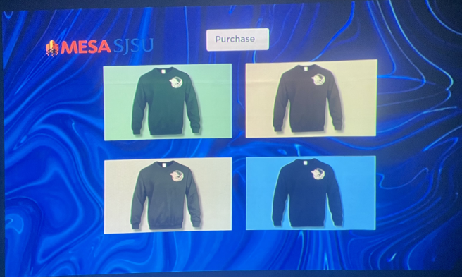
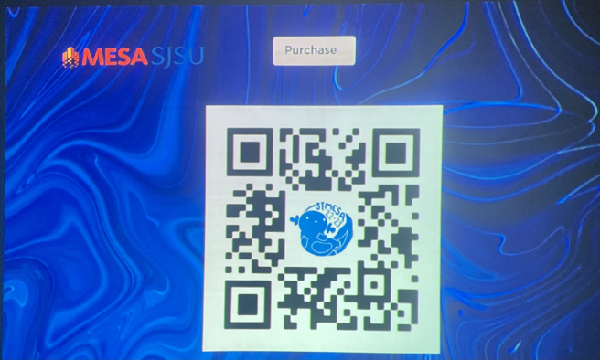
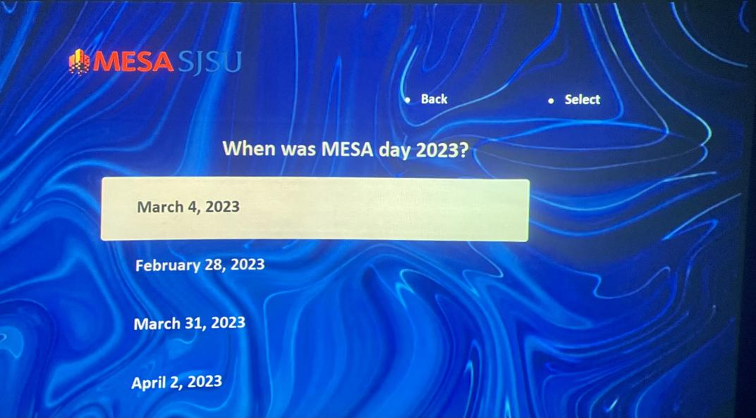

<!-- Improved compatibility of back to top link: See: https://github.com/othneildrew/Best-README-Template/pull/73 -->
<a name="readme-top"></a>
<!--
*** Thanks for checking out the Best-README-Template. If you have a suggestion
*** that would make this better, please fork the repo and create a pull request
*** or simply open an issue with the tag "enhancement".
*** Don't forget to give the project a star!
*** Thanks again! Now go create something AMAZING! :D
-->


<!-- PROJECT SHIELDS -->
<!--
*** I'm using markdown "reference style" links for readability.
*** Reference links are enclosed in brackets [ ] instead of parentheses ( ).
*** See the bottom of this document for the declaration of the reference variables
*** for contributors-url, forks-url, etc. This is an optional, concise syntax you may use.
*** https://www.markdownguide.org/basic-syntax/#reference-style-links
-->

<!-- PROJECT LOGO -->
<br />
<div align="center">
  <a href="https://github.com/kumarkrishh/RokuInternship2023">
    
  </a>

<h3 align="center">Join MESA App</h3>

  <p align="center">
    This Roku TV app is designed for underrepresented students to experience a hands-on STEM education through participating in the MESA (Mathematics, Engineering, Science Achievement) program. 
  </p>
</div>

## About The Project

The MESA Fundraising and Promotion App was developed as part of an internship with Roku, with the goal of supporting the MESA program's fundraising and promotional efforts. MESA operates on a tight budget, collecting only $10 per year from each member, with financial assistance available for those who qualify. As a result, additional fundraising is essential to ensure that MESA can continue to offer the high-quality events, competitions, and projects that are critical to student success.

### Key Features

- **Fundraising Integration**: The app provides a platform for organizing and promoting fundraising activities, including merchandise sales and events, to help MESA secure the necessary funds to support its mission.
- **Event Updates**: Regular updates about MESA clubs, competitions, and events keep students and parents informed and engaged.
- **Community Connection**: The app fosters a sense of community among MESA clubs, encouraging collaboration and mutual support even as they compete in national competitions.
- **Feedback and Continuous Improvement**: We value the input of our users. Students can offer feedback directly through the app, which will be used to refine and enhance the app, ensuring it meets and exceeds their needs.

### Why It Matters

MESA is more than just a program—it's a gateway to opportunity for students from underrepresented backgrounds. By supporting MESA through this app, we help sustain a vital resource that levels the playing field, providing critical educational opportunities and pathways to STEM careers. Every purchase, every event, and every bit of feedback helps make a difference in the lives of these students.

### Screenshots

<div align="center">
  
  <p>Homepage: The central hub for all MESA activities, events, and updates.</p>
</div>

<div align="center">
  
  <p>Video Screen: Promotional and educational videos to engage students and parents.</p>
</div>

<div align="center">
  
  <p>Shop Screen: A platform for purchasing MESA merchandise to support fundraising efforts.</p>
</div>

<div align="center">
  
  <p>Purchase Screen: Seamless and secure purchasing process for MESA merch.</p>
</div>

<div align="center">
  
  <p>Game Screen: Interactive content to engage students in a fun and educational way.</p>
</div>


### Built With

* [![Roku][Roku]][Roku-url]
* [BrightScript Scripting Language](https://developer.roku.com/docs/references/brightscript/language/brightscript-language-reference.md)


<p align="right">(<a href="#readme-top">back to top</a>)</p>


<!-- GETTING STARTED -->
## Getting Started

1. Make sure you have a Roku Device and have successfully put your device on [Developer Mode](https://developer.roku.com/docs/developer-program/getting-started/developer-setup.md)
2. Clone the repo
   ```sh
   git clone https://github.com/kumarkrishh/RokuInternship2023.git
   ```
3. Follow the instructions to [install the channel (sideload) on your Roku Device](https://developer.roku.com/docs/developer-program/getting-started/developer-setup.md)


<!-- MARKDOWN LINKS & IMAGES -->
<!-- https://www.markdownguide.org/basic-syntax/#reference-style-links -->
[contributors-shield]: https://img.shields.io/github/contributors/kumarkrishh/RokuInternship2023.svg?style=for-the-badge
[contributors-url]: https://github.com/kumarkrishh/RokuInternship2023/graphs/contributors
[forks-shield]: https://img.shields.io/github/forks/kumarkrishh/RokuInternship2023.svg?style=for-the-badge
[forks-url]: https://github.com/kumarkrishh/RokuInternship2023/network/members
[stars-shield]: https://img.shields.io/github/stars/kumarkrishh/RokuInternship2023.svg?style=for-the-badge
[stars-url]: https://github.com/kumarkrishh/RokuInternship2023/stargazers
[issues-shield]: https://img.shields.io/github/issues/kumarkrishh/RokuInternship2023.svg?style=for-the-badge
[issues-url]: https://github.com/kumarkrishh/RokuInternship2023/issues
[license-shield]: https://img.shields.io/github/license/kumarkrishh/RokuInternship2023.svg?style=for-the-badge
[license-url]: https://github.com/kumarkrishh/RokuInternship2023/blob/master/LICENSE.txt
[linkedin-shield]: https://img.shields.io/badge/-LinkedIn-black.svg?style=for-the-badge&logo=linkedin&colorB=555
[linkedin-url]: https://www.linkedin.com/in/krishkum/
[Roku]: https://img.shields.io/badge/Roku%20Scenegraph-purple?style=for-the-badge&logo=Roku
[Roku-url]: https://developer.roku.com/docs/developer-program/getting-started/hello-world.md

